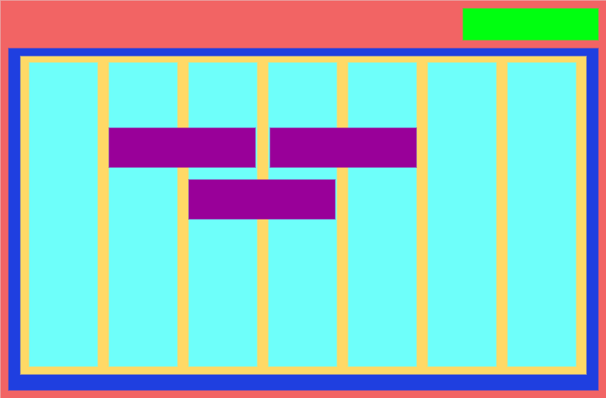

# Prototyping

The primary structure that I projected to the Timeline app is as the following image displays:

Each rectangle refers to a component:

Red - `timeline_container`
Green - `timeline_action_header`
Dark Blue - `timeline_events_container`
Yellow - `timeline_dates_header`
Cyan - `timeline_date`
Black - `timeline_events_badges_container`
Purple - `timeline_event_badge`

The purple rectangles are there also to demonstrate possible renderings of the event badges.